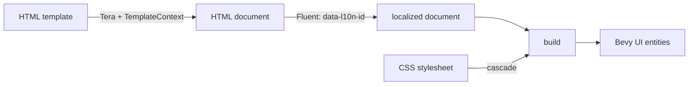

# bevy_markup

Write game UI the way you'd write a web page, and get native
[Bevy](https://bevyengine.org) UI out of it.

bevy_markup is a Bevy 0.19 library. You describe a piece of UI as an HTML template,
style it with CSS, and translate it with [Fluent](https://projectfluent.org);
bevy_markup turns that into ordinary Bevy UI entities (`Node`, `Text`, `TextSpan`,
`ImageNode`). No browser, no web view: the result is plain Bevy UI that lays
out with Bevy's own flexbox and renders like everything else in your game.

```html
<!-- examples/assets/quickstart/hello.html -->
<h1 data-l10n-id="hello-title">Hello, HTML!</h1>
<p data-l10n-id="hello-greeting" data-l10n-args='{"name": "{{ player }}"}'>Welcome, {{ player }}.</p>
<div class="wallet">
  <p data-l10n-id="hello-coins" data-l10n-args='{"coins": {{ coins }}}'>You have {{ coins }} coins.</p>
  <p id="add-coin" class="action" data-l10n-id="hello-add-coin">+ Add a coin</p>
</div>
```

```css
/* examples/assets/quickstart/style.css */
html {
  color: #e6e6e6;
  font-family: serif;
  font-size: 24px;
  border-image: url("../ui/frame.png") 16 fill stretch; /* a 9-slice frame */
  border-width: 16px;
  padding: 20px 32px;
}
h1 { color: #f0b429; font-size: 44px; font-weight: bold; }
```

```ftl
# examples/assets/quickstart/locales/en-US/hello.ftl
hello-greeting = Welcome, <b>{ $name }</b>.
hello-coins =
    { $coins ->
        [0] You have <em>no</em> coins.
        [one] You have <em>one</em> coin.
       *[other] You have <em>{ $coins }</em> coins.
    }
```

```rust
use bevy::prelude::*;
use bevy_markup::prelude::*;

fn main() {
    App::new()
        .add_plugins((DefaultPlugins, BevyMarkupPlugin))
        .add_systems(Startup, setup)
        .run();
}

fn setup(mut commands: Commands, assets: Res<AssetServer>) {
    commands.spawn(Camera2d);
    commands.insert_resource(DefaultStylesheet::new(assets.load("quickstart/style.css")));
    commands.insert_resource(ActiveLocale::new(assets.load("quickstart/locales/en-US/main.ftl.ron")));
    commands.spawn((
        HtmlUi::new(assets.load("quickstart/hello.html")),
        TemplateContext::new().with("player", "Ada").with("coins", &0),
    ));
}
```

Change `coins` in the entity's `TemplateContext` and the UI updates. Swap
`DefaultStylesheet` and you have a new theme; swap `ActiveLocale` and the
whole UI switches language. Changed or reloaded templates, stylesheets and
translations are picked up too, so with Bevy's asset hot-reloading
(`file_watcher` feature) you can edit the UI while the game runs.

## How it works

Every `HtmlUi` entity goes through a small pipeline, run by Bevy systems in
`PostUpdate`:



1. **Render.** The template is a [Tera](https://keats.github.io/tera/) template
   (loops, conditionals, filters, includes). It's rendered with the entity's
   `TemplateContext` and parsed as HTML.
2. **Localize.** Elements with a `data-l10n-id` get their content replaced by
   the Fluent translation from the active locale, with `data-l10n-args` as
   arguments, following the same conventions as Mozilla's `fluent-dom`.
   Translations may contain inline markup (`<b>`, `<em>`, …), which is
   styled like the rest of the page. An element's own content is the
   fallback when a message is missing.
3. **Style.** The CSS is parsed with
   [lightningcss](https://lightningcss.dev) and cascaded the way a browser
   would: specificity, `!important`, source order and inheritance.
4. **Build.** Block elements (`p`, `h1`–`h6`, `li`, `pre`) become `Text`
   nodes with one `TextSpan` per styled run of text; containers (`div`,
   `section`, `ul`, …) become flex nodes. Each carries an `HtmlElement`
   component (tag, id, classes), so your code can find them with the
   `HtmlElements` system parameter and attach behaviour after every build
   (the `HtmlUiBuilt` event).

When only the styling changes (a new theme, a reloaded stylesheet), bevy_markup
restyles the existing entities in place instead of rebuilding them.

### What's supported

bevy_markup implements a useful subset of the web, not all of it:

- **HTML:** headings, paragraphs, lists, `pre`, inline elements, and
  containers as nested flex nodes.
- **CSS:** type, class, id and compound selectors (`p.note`, `h1#title`);
  colors and fonts (inherited); flex and grid layout (`display`,
  `flex-direction`, `justify-content`, `align-items`, `gap`,
  `grid-template-columns`, `grid-column`, …); sizes, margins, padding,
  `box-sizing`; borders and background colors; 9-slice frames through
  `border-image`. Combinators (`.panel p`), pseudo-classes (`:hover`) and
  `calc()` aren't supported yet; unsupported CSS is skipped, never guessed.
- **Fluent:** messages, arguments, plurals and selectors, inline markup.
- **Fonts:** you register font files under CSS family names
  (`FontFamilies`), including bold and italic faces and the generic
  families (`serif`, `monospace`, …).

The crate documentation (`cargo doc --open`) is the full guide.

## Bevy compatibility

| bevy_markup | Bevy | bevy_fluent |
|---|---|---|
| 0.2 | 0.19 | 0.15 |
| 0.1 | 0.19 | 0.15 |

### Recommended: patched fluent-syntax

The fluent-syntax version Bevy's Fluent integration uses
(0.11) has two bugs that a malformed translation file can
trigger: a panic on a broken unicode escape, and a stack
overflow (process abort) on deeply nested expressions. Until
upstream fixes are released, add this to your app's
`Cargo.toml` (cargo applies `[patch]` only in the top-level
project, so bevy_markup can't do it for you):

```toml
[patch.crates-io]
fluent-syntax = { git = "https://github.com/nchashch/fluent-rs", branch = "fix/fuzzing-bugs-0.11" }
```

It matters most if players can load their own translations or mods.

## Running the examples

```sh
cargo run --example quickstart   # the code above, plus a button and a language switch
cargo run --example grid         # CSS grid: page layout, responsive slots, spans
cargo run --example demo         # themes, languages, scrolling, 9-slice frames, DOM outlines
```

Their templates, stylesheets, translations and images are in
`examples/assets/`. Text uses the fonts installed on your system (CSS
`serif`, `sans-serif` and `monospace`, via Bevy's `system_font_discovery`),
so no font files ship with the repository.

## Testing

A UI library is easy to get subtly wrong: a rule that applies in the wrong
order, a translation that never updates, a layout that's a few pixels off,
or a crash on input nobody thought of. bevy_markup checks itself in layers, each
catching a different kind of mistake.

**Examples, written down.** Unit tests cover the small pieces (CSS value
mapping, the cascade, the rebuild logic). Test *vectors* are complete small
pages in `tests/vectors/`: HTML, CSS, sometimes translations, plus the
expected result. A headless test harness runs bevy_markup inside a real Bevy app
without a window and compares a text dump of the resulting UI tree with the
expected one.

**Compared against the real thing.** For vectors, the expected results don't
come from bevy_markup itself. Two *oracles* produce them independently:

- headless Chrome computes the CSS (styles and layout positions) of every
  vector, and bevy_markup's output must match what the browser does;
- Mozilla's own `@fluent/dom` translates the Fluent vectors, and bevy_markup must
  produce the same text.

Both reference outputs are committed, and CI checks nightly that the current
Chrome still agrees with them.

**Generated inputs.** Hand-written examples only test what someone thought
of. *Property tests* generate thousands of random stylesheets, documents
and translations and check rules that must always hold: for example that
restyling in place gives exactly what a fresh build would, or that
generated flex layouts obey the guarantees of the CSS flexbox spec (a
`row-reverse` row mirrors a `row`, for instance). A *state machine*
test drives a running UI through random sequences of changes (templates,
contexts, stylesheets, languages, reloads, in any order) and checks after
every step that the UI matches a simple model of what it should show.

**Fuzzing.** Fuzzers feed malformed and adversarial input (broken HTML,
garbage CSS, pathological translations) to the parsing and translation code
to find crashes and hangs. Four fuzzing engines run against the same
harnesses (libFuzzer, honggfuzz, fuzzcheck and AFL++). The inputs that
reached new code are kept as committed seeds in `fuzz/seeds/`, and CI fuzzes
every night, carrying its corpus over from one night to the next.

**Content lint.** For the shipped game content, a lint renders every
template and checks that every translation key exists, that no text is
hard-coded instead of translated, that CSS image paths resolve, and that
the UI survives *pseudo-localization* (artificially longer, accented
translations, as real languages often are).

**Golden images.** A few scenes are rendered for real (on a software GPU)
and compared with reference screenshots, to catch problems only visible in
pixels: font rasterization, text wrapping, 9-slice drawing.

**Testing the tests.** Two tools check that the tests themselves are good
enough:

- *Mutation testing* ([cargo-mutants](https://mutants.rs)) makes hundreds
  of small deliberate bugs in the library, one at a time (flips a
  condition, deletes a line, returns a wrong value) and checks that some
  test fails for each. A "mutant" that survives points at code no test
  really checks. Every survivor gets a new test or a written explanation of
  why the change can't affect behaviour.
- *Coverage* measures which lines of the library each testing layer
  actually runs, and which lines nothing runs at all. Currently about 98%
  of the library's lines run under at least one layer.

Coverage shows that code ran; mutation testing shows that its result was
checked. Together they point at gaps the other layers leave.

**Bugs found so far.** Every real defect found this way is written up in
`docs/agents/bugs/` (reproduction, cause, fix and the regression test that
now guards it). Fifteen so far, from wrong cascade order and layout
differences against the browser to crashes deep inside dependencies. Bugs
in third-party crates are fixed locally where possible and tracked in
`docs/agents/bugs/UPSTREAM.md` so they can be reported upstream.

### Running the tests

```sh
cargo test                                  # unit tests, vectors, properties, state machine
cargo test --lib --features fuzzing         # the fuzz harnesses' own tests
scripts/fuzz-libfuzzer.sh html 60           # fuzz one target for a minute (nightly Rust)
scripts/mutants.sh                          # mutation testing
scripts/coverage.py --html                  # coverage per testing layer
scripts/browser_oracle.py                   # regenerate the Chrome references
scripts/golden.sh                           # golden images
```

`docs/agents/skills/testing.md` explains every layer in detail: when to use
which, how to add a vector or a property, how the oracles work, and how a
bug is filed.

### Continuous integration

- **Every push and pull request:** the library must build without warnings
  in every configuration, all tests must pass, the docs must build, and the
  committed Fluent references must be current.
- **Nightly:** golden images, the Chrome oracle against the current
  browser, 15 minutes of fuzzing per target (continuing from the previous
  night), and a coverage report you can download as a browsable HTML page.
- **Twice a week:** a full mutation-testing run, split over four parallel jobs.

Dependency builds are cached and shared between jobs, so most jobs spend
their time testing rather than compiling Bevy.

## Project layout

```
src/            the library
examples/       quickstart, grid and demo
tests/          headless harness, test vectors, property and state machine tests
fuzz/           cargo-fuzz targets and committed seeds (other fuzzers in
                honggfuzz/, fuzzcheck/, test-fuzz/)
scripts/        oracles, fuzzing, mutation testing, coverage, golden images
docs/agents/    developer docs: testing guide, bug reports
AGENTS.md       detailed project notes: architecture, conventions, gotchas
```

## Status

An early prototype on Bevy 0.19. The API may still change. Things not
built yet include CSS combinators and pseudo-classes (`:hover`), keyed
updates that keep entities across content changes, and forms or inputs.

## License

Licensed under either of

- Apache License, Version 2.0 ([LICENSE-APACHE](LICENSE-APACHE) or
  <http://www.apache.org/licenses/LICENSE-2.0>)
- MIT license ([LICENSE-MIT](LICENSE-MIT) or <http://opensource.org/licenses/MIT>)

at your option.

Unless you explicitly state otherwise, any contribution intentionally
submitted for inclusion in the work by you, as defined in the Apache-2.0
license, shall be dual licensed as above, without any additional terms or
conditions.
